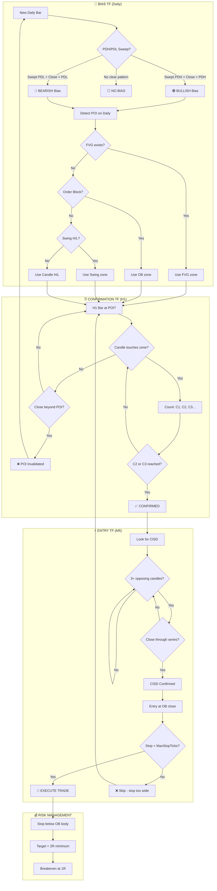

# Strategy Architecture Document: TTrades Fractal Model

**Model ID:** #1 (skill_combinations)
**Source:** [The Only Trading Strategy You Need For 2026](https://www.youtube.com/watch?v=9AL41xON3hA)
**Creator:** TTrades
**Status:** Active Development (V20)

---

## Overview

The Fractal Model is a multi-timeframe trading system built on one core principle:

> **"Price cannot reverse without forming a swing point."**

This model aligns three configurable timeframes (Bias → Confirmation → Entry) to catch high-probability reversals and continuations.

---

## 3-Timeframe Architecture (V16)



---

## Timeframe Roles

| Timeframe | Role | Default | Key Actions |
|-----------|------|---------|-------------|
| **Bias TF** | Direction + POI | Daily | PDH/PDL sweep, POI detection |
| **Confirmation TF** | C2/C3 counting | H1 | Count touches at POI zone |
| **Entry TF** | CISD + execution | M5 | CISD pattern, OB entry |

---

## POI Types (Priority Order)

| Priority | Type | Detection Logic |
|----------|------|-----------------|
| 1 | **FVG** | Gap between candle[0].Low and candle[2].High |
| 2 | **Order Block** | Last opposite candle before 1.5x displacement |
| 3 | **Swing** | Low[1] < Low[0] AND Low[1] < Low[2] |
| 4 | **Candle H/L** | Prior candle low/high (fallback) |

**V14.1 Zone Sizing (Candle H/L):**
- Zone width = `Max(20 ticks, 30% of daily candle range)`
- Prevents premature invalidation

---

## Skills Used (14)

| Phase | Skill ID | Skill Name | Role |
|-------|----------|------------|------|
| Framework | 70 | Timeframe Alignment | TF pairing rules |
| Bias | 62 | Daily Bias Determination | Direction from daily closure |
| Structure | 53 | Swing Point | Core concept - reversals need swings |
| Structure | 4 | CISD Pattern | Confirms swing point validity |
| POI | 55 | Fair Value Gap | Entry zone identification |
| Confirmation | 64 | Candle 2 Closure | POI closure for reversal setups |
| Confirmation | 65 | Candle 3 Closure | Alternative POI closure |
| Entry | 67 | Order Blocks for Continuations | LTF entry via continuation OB |
| Risk | 63 | Protected Swings | Stop placement rule |
| Target | 89 | 2R Target | Minimum risk/reward |
| Edge Case | 79 | Failure Swing | Multiple = consolidation |
| Edge Case | 97 | Consolidation Phase Rules | When continuation fails |
| Context | 91 | Candle 1 Reference | Reference for sequence start |
| Context | 66 | Candle 4 Expansion | Post-entry validation |

---

## Entry Checklist

**Required:**
- [ ] Daily bias determined (sweep + close pattern)
- [ ] POI identified on Bias TF
- [ ] C2 or C3 touched POI zone (Confirmation TF)
- [ ] CISD confirmed on Entry TF
- [ ] Stop ≤ MaxStopTicks (20 default)
- [ ] Target achieves 2R minimum

**Invalidation:**
- [ ] Price closes beyond POI zone (wrong side)
- [ ] Stop would exceed MaxStopTicks

---

## State Machine (V16)

```
States:
  Idle                  → Waiting for session
  WaitingForSweep       → Looking for PDH/PDL sweep
  BiasSet               → Daily bias confirmed
  CountingConfirmation  → Counting C1, C2, C3 at POI
  Confirmed             → C2/C3 confirmed, drop to Entry TF
  WaitingForCISD        → On Entry TF, looking for CISD
  CisdConfirmed         → Entry ready
  InTrade               → Position open

Transitions:
  Idle → WaitingForSweep:     Session opens
  WaitingForSweep → BiasSet:  PDH/PDL sweep detected
  BiasSet → CountingConfirmation: POI identified on Bias TF
  CountingConfirmation → Confirmed: C2/C3 touches POI
  Confirmed → WaitingForCISD: Drop to Entry TF
  WaitingForCISD → CisdConfirmed: CISD pattern completes
  CisdConfirmed → InTrade: Entry executed
  InTrade → Idle: Stop or target hit
```

---

## Parameters (V16)

### Timeframe Configuration
| Parameter | Default | Description |
|-----------|---------|-------------|
| BiasTFType | Day | Timeframe type for bias + POI |
| BiasTFPeriod | 1 | Period (1 = Daily) |
| ConfirmationTFType | Minute | Timeframe type for C2/C3 |
| ConfirmationTFPeriod | 60 | Period (60 = H1) |
| EntryTFType | Minute | Timeframe type for CISD |
| EntryTFPeriod | 5 | Period (5 = M5) |

### POI Settings
| Parameter | Default | Description |
|-----------|---------|-------------|
| UseFvgPOI | true | Enable FVG as POI type |
| UseOBPOI | true | Enable Order Block as POI type |
| UseSwingPOI | true | Enable Swing as POI type |
| UseCandlePOI | true | Enable Candle H/L as POI type |
| MaxPOIDistanceTicks | 80 | Invalidate POI if too far |

### Entry/Risk
| Parameter | Default | Description |
|-----------|---------|-------------|
| MinConfirmationCandles | 2 | C2 = 2, C3 = 3 |
| CISDMinCandles | 2 | Min opposing candles for CISD |
| MaxStopTicks | 20 | Skip if stop too wide |
| MinStopTicks | 4 | Skip if stop too tight |
| EnablePartialProfits | true | 50% exit at 1R |
| PartialExitRR | 1.0 | R-multiple for partial |

---

## Data Series Structure

```csharp
// V16: 3 Configurable Timeframes with proper naming
private const int IDX_ENTRY = 0;        // Primary chart = Entry TF (M5)
private const int IDX_CONFIRMATION = 1; // Confirmation TF (H1)
private const int IDX_BIAS = 2;         // Bias TF (Daily)

// V16 FIX: POI variables use biasTF prefix (not h1)
private double biasTFPoiTop = 0;
private double biasTFPoiBottom = 0;
private bool biasTFPoiValid = false;
private POIType biasTFPoiType = POIType.None;

protected override void OnStateChange()
{
    if (State == State.Configure)
    {
        AddDataSeries(ConfirmationTFType, ConfirmationTFPeriod); // H1
        AddDataSeries(BiasTFType, BiasTFPeriod);                 // Daily
    }
}
```

---

## Key Learnings (from V10-V16 iterations)

1. **POI must be on Bias TF** - Not Confirmation TF (V14 fix)
2. **C2/C3 = TOUCH, not CLOSE** - Count candles that touch POI, no reset
3. **FVG persists across sessions** - Only invalidate when price sweeps through
4. **Stop below OB BODY** - Not wick, not FVG
5. **Entry at OB close** - Not 50% retracement, not CISD close
6. **Don't over-filter entries** - MaxStopTicks is sufficient
7. **Candle H/L zones need width** - Min 20 ticks or 30% of daily range
8. **FVG must validate candle[1]** - Gap invalid if middle candle bridges it (V16 fix)
9. **OB = LAST OPPOSING candle** - Not CISD candle (V16 fix)
10. **Variable naming matters** - Use `biasTFPoi*` not `h1Poi*` (V16 fix)

---

## Expected Performance

| Metric | Target |
|--------|--------|
| Trades/Year | 100-150 |
| Win Rate | 45-55% |
| Avg Risk | 12-20 ticks |
| R:R Ratio | 2:1 minimum |
| Max Drawdown | < $10,000 |

---

## Changelog

| Date | Version | Changes |
|------|---------|---------|
| 2026-01-03 | 1.0 | Initial extraction from YouTube |
| 2026-01-04 | 4.0 | True ICT mechanics, ERL→IRL flow |
| 2026-01-05 | 10.0 | 3-TF alignment (Daily → H1 → M5) |
| 2026-01-05 | 11.0 | Two-level FVG, stop below OB BODY |
| 2026-01-05 | 12.0 | FVG persistence, partial profits |
| 2026-01-05 | 13.0 | C2/C3 confirmation, multiple POI types |
| 2026-01-05 | 14.0 | **POI on Bias TF**, 4 POI types, 6 TF params |
| 2026-01-05 | 14.1 | Wider Candle H/L zones, fixed POI priority |
| 2026-01-05 | 15.0 | Removed PDH/PDL requirement (different strategy) |
| 2026-01-05 | 16.0 | **Restored 3-TF architecture**, FVG candle[1] validation, OB entry fix |
| 2026-01-05 | 17.0 | H1 structure validation, state machine refinements |
| 2026-01-06 | 18.0 | Stop below CISD candle (not OB body) - visual evidence fix |
| 2026-01-06 | 19.0 | Increased invalidation threshold from 3 to 6 bars (30 min buffer) |
| 2026-01-06 | 20.0 | **POI-type-specific invalidation** (FVG=6, OB/Swing/CandleHL=30 closes), protected swings terminology |

---

## V20 Key Changes

### 1. POI Type-Specific Invalidation

**Problem**: V19 treated all POI types identically - 6 consecutive closes beyond zone would invalidate. But Daily swings, OBs, and candle highs/lows often see temporary price overshoots during valid setups.

**Solution**: Different invalidation thresholds by POI type:

| POI Type | Threshold | Duration | Rationale |
|----------|-----------|----------|-----------|
| **FVG** | 6 closes | 30 min | FVGs are sensitive - price closing through invalidates |
| **Order Block** | 30 closes | 2.5 hours | OBs can see deep retests, need sustained break |
| **Swing** | 30 closes | 2.5 hours | Price often sweeps beyond swing levels temporarily |
| **Candle H/L** | 30 closes | 2.5 hours | Daily highs/lows regularly see temporary breaches |

### 2. Protected Swings Entry Pattern

**Terminology clarification**: "Opposing candles" renamed to "downclose candles" (for bullish setups) to match TTrades terminology.

**Entry Logic** (unchanged from V19, just clarified):
1. After POI touch (C2 confirms), track 1-5 consecutive downclose M5 candles
2. Entry triggers when price closes ABOVE the FIRST downclose candle's OPEN
3. Can be just 1 candle if that's what confirms
4. Series resets if it exceeds `MaxDowncloseSeriesCount` (default 5) - treats as consolidation, not pullback

### 3. Visual Evidence Reference

**Source Video**: https://youtu.be/-wr4xATE37g

**Key Observations**:
- POI can be exceeded within session if bias is followed
- Protected swings = consecutive downclose candles after C2
- Entry on close above first downclose candle's open
