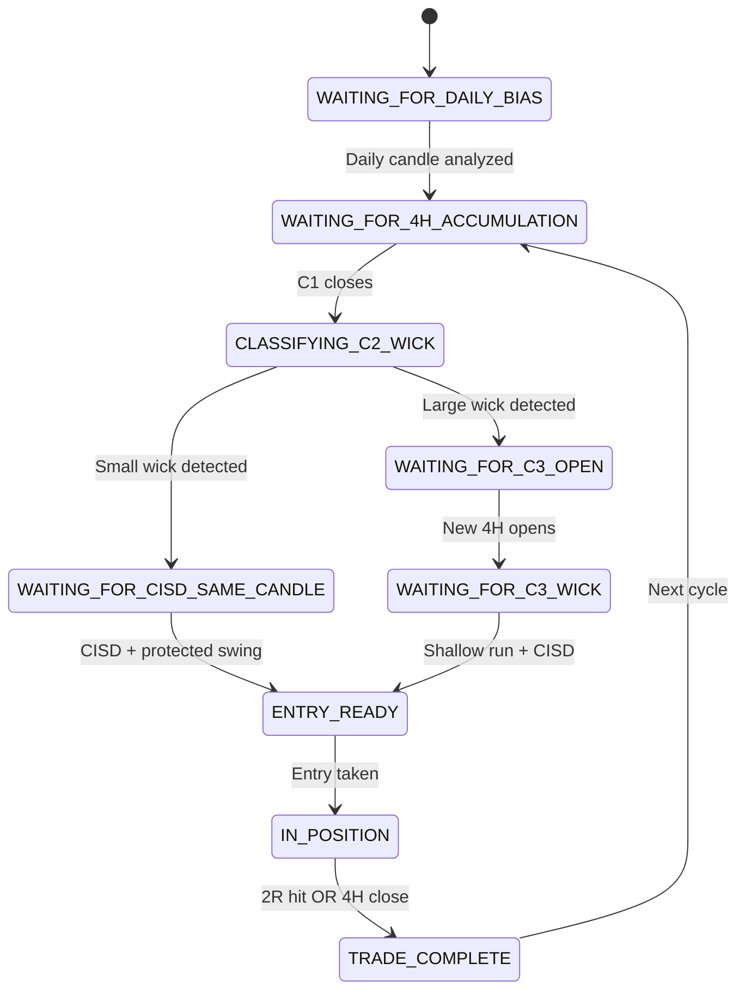

# TTrades 4-Hour Power of Three (4H PO3)

## Model Overview

| Field | Value |
|-------|-------|
| **Model Name** | TTrades 4-Hour Power of Three |
| **Slug** | ttrades-4h-po3 |
| **Author** | TTrades |
| **Source** | https://youtu.be/FAKWJ-1NlLE |
| **Model Type** | Intraday Scalp / Day Trade |
| **Complexity** | Intermediate-Advanced |
| **Trade Type** | Both Reversal and Continuation |

## Core Edge

Trade the distribution phase of a 4-hour candle by waiting for the wick to form (via CISD/protected swing), then trade the body/expansion. The key insight is:

> "Let the wick form, then trade the body."

This model combines:
1. **Daily bias** for directional filter
2. **4H candle structure** for AMD (Accumulation, Manipulation, Distribution) timing
3. **Lower timeframe fractal model** for precise entry confirmation

## Prerequisites

Before using this model, understand:
- Candle 2 / Candle 3 closure concepts
- CISD (Change in State of Delivery)
- Protected swings
- AMD (Power of 3) framework

## Trade Flow

```
Daily Bias Determination
         ↓
4H Candle C1 (Accumulation)
         ↓
Classify C2 Wick Size
         ↓
    ┌────┴────┐
    ↓         ↓
Small Wick  Large Wick
(Same C2)   (Wait for C3)
    ↓         ↓
Wait for    New 4H Candle
CISD        Opens
    ↓         ↓
Protected   Wait for
Swing       Shallow Wick
Forms       + CISD
    ↓         ↓
    └────┬────┘
         ↓
     ENTRY
         ↓
    Target 2R
    or PDH/PDL
```

## Session Timing

### Futures (ES, NQ, etc.)
| 4H Candle | Time (EST) | Role |
|-----------|------------|------|
| Candle 1 | 22:00 - 02:00 | Accumulation (Asian) |
| Candle 2 | 02:00 - 06:00 | Manipulation (London) |
| Candle 3 | 06:00 - 10:00 | Distribution (NY AM) |
| Candle 4 | 10:00 - 14:00 | Continuation or Reversal |

### Forex
| 4H Candle | Time (UTC) | Role |
|-----------|------------|------|
| Various | 17:00, 21:00, 01:00, 05:00 | Different session alignment |

## Entry Rules

### Scenario 1: Small Wick on C2 (Same-Candle Entry)
1. C1 closes (accumulation complete)
2. C2 opens and makes a **shallow opposing run**
3. Look for CISD to confirm wick has formed
4. Protected swing marks stop loss level
5. Enter on CISD, target 2R or PDH/PDL

### Scenario 2: Large Wick on C2 (C3 Continuation Entry)
1. C1 closes (accumulation complete)
2. C2 makes a **large opposing run** - reversal candle
3. Wait for C3 to open (new 4H candle)
4. C3 should make a shallow opposing run
5. Look for CISD + protected swing
6. Enter on confirmation, target 2R or PDH/PDL

### GXT Integration (Lower Timeframe)
For precise entries, drop to 3m or 5m timeframe:
1. Wait for LTF fractal model to align
2. Consolidation → Sweep → CISD sequence
3. Entry on LTF CISD confirms 4H wick formation

## Exit Rules

### Targets
- **Primary**: 2R from entry
- **Secondary**: Previous day high/low
- **Tertiary**: -1 standard deviation from range

### Stop Loss
- On protected swing (wick low/high)
- Or above 50% of CISD candle + EQ

### Time Management
- Don't hold past 4H candle close
- New 4H candle = new opportunity
- Expansion candles have limited range/time

## Risk Management

| Parameter | Value |
|-----------|-------|
| Risk per trade | 1% of account |
| Minimum R:R | 2:1 |
| Max trades per 4H candle | 1-2 |

## Constraints

1. **Entry REQUIRES** CISD confirmation
2. **Entry REQUIRES** protected swing formation
3. **Do NOT enter** if price extended beyond EQ of previous range
4. **Do NOT chase** - let the wick form first
5. **New 4H candle** = new opportunity (don't hold across boundaries)
6. **Expansion met with expansion** = opposite direction signal

## State Machine



## Skills Used

### Bias Phase
| ID | Skill | Phase Order |
|----|-------|-------------|
| #62 | Daily Bias Determination (TTrades) | 1 |
| #68 | Equilibrium Trading (TTrades) | 2 |

### Setup Phase
| ID | Skill | Phase Order |
|----|-------|-------------|
| #91 | Candle 1 Reference (TTrades) | 1 |
| #64 | Candle 2 Closure (Reversal) | 2 |
| #74 | Wick Analysis (TTrades) | 3 |
| #75 | Power of 3 (AMD Framework) | 4 |

### Confirmation Phase
| ID | Skill | Phase Order |
|----|-------|-------------|
| #4 | CISD Pattern | 1 |
| #65 | Candle 3 Closure (Confirmation) | 2 |
| #63 | Protected Swings (TTrades) | 3 |

### Entry Phase
| ID | Skill | Phase Order |
|----|-------|-------------|
| #66 | Candle 4 Expansion (TTrades) | 1 |
| #82 | Expansion Phase | 2 |
| #100 | GXT Integration (4H + Fractal) | 3 |

### Management Phase
| ID | Skill | Phase Order |
|----|-------|-------------|
| #98 | 4H Session Timing (Futures) | 1 |
| #99 | 4H Session Timing (Forex) | 1 |
| #8 | Time-based Session Windows | 2 |
| #86 | Dynamic Target Levels | 3 |

## Example Trades

### Example 1: ES Futures - C3 Continuation
- **Daily Bias**: Bullish (Wednesday reversal, Thursday continuation)
- **4H Setup**: 2:00 reversal candle (large wick on C2)
- **Entry**: 6:00-10:00 window, waited for shallow opposing run
- **Confirmation**: CISD + protected swing at FVG
- **Target**: Previous day high
- **Result**: 2R+ winner

### Example 2: Gold - Same-Candle Entry (GXT)
- **Daily Bias**: Bearish
- **4H Setup**: 2:00 reversal, looking for 6:00 continuation
- **LTF Entry**: 3m fractal model, sweep of consolidation high
- **Confirmation**: CISD below consolidation
- **Target**: -1 deviation
- **Result**: 2R winner with positional entry

## Video Frames Reference

Key educational frames saved to: `data/video-frames/FAKWJ-1NlLE/frames/`

| Frame | Timestamp | Content |
|-------|-----------|---------|
| frame_001.jpg | 0:00 | Title - "4 Hour PO3" |
| frame_003.jpg | 1:30 | Two candle types diagram |
| frame_007.jpg | 4:30 | ES 15m chart with C2 annotation |
| frame_010.jpg | 7:30 | USD/JPY 4H weekly reversal |
| frame_017.jpg | 12:00 | Gold 3m GXT setup |
| frame_025.jpg | 18:45 | NQ 5m trade with R:R overlay |

## Related Models

- **TTrades Fractal Model (TTFM)** - Lower timeframe entry model used with GXT
- **Lumi Potential Sweep** - Similar AMD-based reversal model

## Source Video

- **Title**: Trading The 4 Hour Power Of Three - OHLC / OLHC
- **URL**: https://youtu.be/FAKWJ-1NlLE
- **Duration**: ~21 minutes
- **Creator**: TTrades

---

*Extracted: 2026-01-05*
*Extraction Confidence: 92%*
