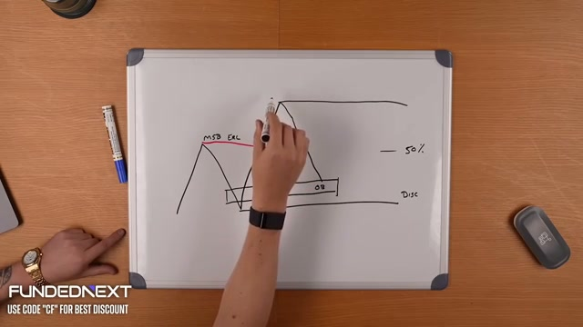
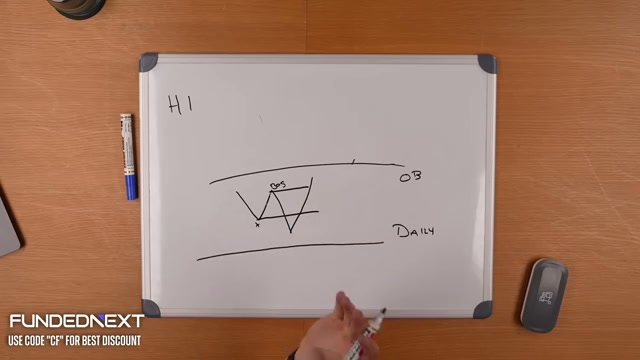
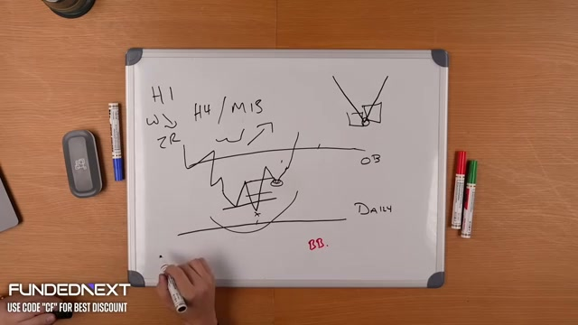
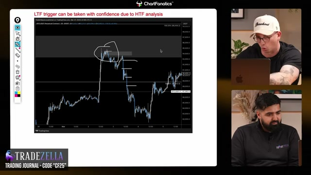
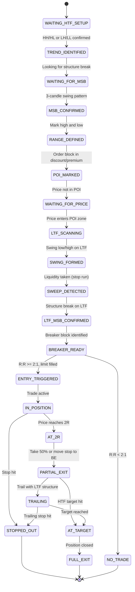
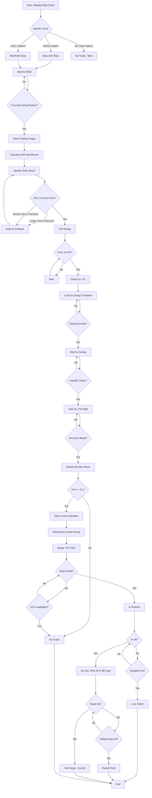

# Trader Maine ICT Model

## Metadata

```yaml
name: "Trader Maine ICT Model"
slug: trader-maine-ict
author: "Trader Maine (via Chart Fanatics / Breakout)"
source_url: "https://youtu.be/coBMd1vk2Lo"
type: "complete_strategy"
complexity: "medium"
timeframes: ["Weekly", "Daily", "H4", "H1", "M15", "M5"]
markets: ["Crypto", "Forex", "Indices"]
generated: "2026-01-06"
confidence: 0.85
frames_dir: "../video-frames/coBMd1vk2Lo/frames/"
frame_index: "../video-frames/coBMd1vk2Lo/frame_index.json"
```

### Visual Reference Gallery

Key frames extracted from video at 60-second intervals. These whiteboard drawings and chart examples illustrate the core concepts.

| Frame | Timestamp | Content |
|-------|-----------|---------|
|  | 25:00 | **Trading Range**: MSB, ERL, OB, 50% equilibrium, Discount zone |
|  | 31:00 | **MSB Pattern**: 3-candle swing W-shape with Order Block |
|  | 36:00 | **Multi-TF**: H1, H4/M15, 2R target, OB, Daily, BB |
|  | 50:00 | **Chart Example**: "LTF trigger with HTF confidence" |

---

## 1. Model Overview

The **Trader Maine ICT Model** is a multi-timeframe institutional trading strategy that combines higher timeframe (HTF) directional bias with lower timeframe (LTF) precision entries using the "Breaker Block" technique.

### Core Edge

The strategy generates edge through:

1. **HTF Directional Bias** - Identify the dominant trend on weekly/daily charts
2. **Trading Range Markup** - Define the current range using market structure breaks (MSB)
3. **Order Block (POI) Identification** - Find high-probability entry zones in discount/premium
4. **LTF Precision Entry** - Use the breaker block pattern for tight entries with defined stops
5. **Asymmetric Risk:Reward** - Minimum 2:1 R:R on every trade (33% win rate = breakeven)

### Philosophy

> "You only need to win 33% of the time with 2:1 R:R to break even. Anything above that is profit."

The model is purely mechanical and rules-based. If the criteria are not met, no trade is taken.

---

## 2. Timeframe Pairings

| HTF (Bias) | LTF (Entry) | Use Case | Hold Duration |
|------------|-------------|----------|---------------|
| Weekly | Daily/H12 | Swing trades | Days to weeks |
| Daily | H1 | Intraday/Swing | Hours to days |
| H4 | M15 | Day trades | 1-4 hours |
| H1 | M5 | Scalps | 15-60 minutes |

**Rule:** Always establish bias on the higher timeframe FIRST, then drop down for entry.

---

## 3. Core Concepts

### 3.1 Market Structure Break (MSB)

> **Visual Reference:** See [frame_031](../video-frames/coBMd1vk2Lo/frames/frame_031.jpg) - MSB swing pattern (W-shape) drawn on whiteboard

A **3-candle swing pattern** that signals a potential trend change:

**For Bullish MSB:**
```
       Candle 3 (breaks above Candle 1 high)
      /
     /
Candle 1    Candle 2 (lower low)
 ____        ____
|    |      |    |
|    |      |    |
|____|______|____|____
```

1. Candle 1: Creates a high
2. Candle 2: Makes a lower low (the swing low)
3. Candle 3: Breaks above Candle 1's high = MSB confirmed

**Key:** The swing low from this pattern becomes the reference point for the higher low.

### 3.2 Trading Range

> **Visual Reference:** See [frame_025](../video-frames/coBMd1vk2Lo/frames/frame_025.jpg) - Complete trading range with MSB, ERL, OB, 50% equilibrium, and Discount zone

After MSB, define the **trading range**:

```
┌─────────────────────────────────────────────────────┐
│                    PREMIUM ZONE (Sell)              │ 75%+
├─────────────────────────────────────────────────────┤
│                    EQUILIBRIUM                       │ 50%
├─────────────────────────────────────────────────────┤
│                    DISCOUNT ZONE (Buy)              │ 25%-
└─────────────────────────────────────────────────────┘
      Range Low (Swing Low)                  Range High (Swing High)
```

- **For longs:** Wait for price to retrace into the DISCOUNT zone (below 50%)
- **For shorts:** Wait for price to push into the PREMIUM zone (above 50%)

### 3.3 Order Block (Point of Interest)

> **Visual Reference:** See [frame_053](../video-frames/coBMd1vk2Lo/frames/frame_053.jpg) and [frame_055](../video-frames/coBMd1vk2Lo/frames/frame_055.jpg) - Real charts showing Order Block zones highlighted

The **Order Block** is the candle/zone where institutions placed orders:

- **Bullish OB:** Last bearish candle before the bullish move (demand zone)
- **Bearish OB:** Last bullish candle before the bearish move (supply zone)

**Validity:**
- OB must be in the appropriate zone (discount for longs, premium for shorts)
- The move away from OB should be impulsive
- OB should not have been revisited (mitigated)

### 3.4 ERL / IRL / DOL Framework

| Concept | Definition | Example |
|---------|------------|---------|
| **ERL** | External Range Liquidity | Swing highs/lows, old highs/lows |
| **IRL** | Internal Range Liquidity | Order blocks, FVGs, imbalances |
| **DOL** | Draw on Liquidity | Where price is targeting next |

**Pattern:** Price moves ERL → IRL → ERL (liquidity sweep to POI to target)

---

## 4. HTF Analysis Framework

### Step 1: Identify Trend Direction

On Weekly/Daily:
- **Bullish:** Higher highs (HH) and higher lows (HL)
- **Bearish:** Lower highs (LH) and lower lows (LL)

### Step 2: Wait for Market Structure Break

Look for the 3-candle swing pattern that confirms:
- In uptrend: A new higher low forming
- In downtrend: A new lower high forming

### Step 3: Mark the Trading Range

- **Range High:** The recent swing high
- **Range Low:** The swing low created by the MSB pattern
- Calculate 50% equilibrium level

### Step 4: Identify Order Block

Find the last opposing candle before the MSB:
- In uptrend: Last bearish candle before the break
- In downtrend: Last bullish candle before the break

**Requirement:** OB must be in discount (for longs) or premium (for shorts)

---

## 5. LTF Entry Technique: The Breaker Block

> **Visual Reference:** See [frame_036](../video-frames/coBMd1vk2Lo/frames/frame_036.jpg) - Complete diagram with H1/H4/M15 timeframes, 2R target, OB, and BB (Breaker Block)

The **Breaker Block** is Trader Maine's primary entry method. It's executed on the LTF when price reaches the HTF POI.

### Breaker Block Long Entry Pattern

```
HTF: Price in discount zone at Order Block

LTF:
                                     Target: HTF ERL
                                          ↑
                                          │
    ┌───┐                           ┌───┐ │
    │   │ ← High that gets broken   │   │ │
    │   │                           │   │ │
    └───┘                           │   │ │
         ↘                          │   │ │
          ↘   Swing Low Forms       │   │ │
           ↘  ┌───┐                │   │ │
              │   │ ← Liquidity    │   │ │
              │   │   engineered   │   │ │
              └───┘                │   │ │
                   ↘               │   │ │
                    ↘ Sweep       │   │ │
                     ↘┌───┐       │   │ │
                       │ X │ ← Stop run (takes liquidity)
                       │   │
                       └───┘
                            ↗
                           ↗ MSB on LTF
                          ↗  (breaks above swing high)
                         ↗
                    ┌───────┐
                    │ ENTRY │ ← Breaker Block = entry zone
                    │       │   (candle that created swing low)
                    └───────┘
                        ↓
                      STOP ← Below the swept swing low
```

### Breaker Block Entry Checklist

1. **Price at HTF POI** - Must be in discount zone at Order Block
2. **Swing Forms on LTF** - Creates obvious swing low with liquidity below
3. **Sweep Occurs** - Price takes out the swing low (stop run)
4. **LTF MSB Confirms** - Price breaks above the high that created the swing
5. **Breaker Identified** - The candle that created the swept swing low = entry zone
6. **R:R Check** - Minimum 2:1 to HTF target
7. **Entry** - Limit order at Breaker Block
8. **Stop** - Below the swept swing low

---

## 6. Entry Rules

> **Visual Reference:** See [frame_050](../video-frames/coBMd1vk2Lo/frames/frame_050.jpg) - Real chart example showing "LTF trigger can be taken with confidence due to HTF analysis"

### Prerequisites (HTF)

- [ ] Established trend direction (HH/HL or LH/LL)
- [ ] Recent MSB confirmed (3-candle swing)
- [ ] Trading range defined (high to low)
- [ ] Order Block marked in discount/premium
- [ ] Price is currently at or approaching POI

### Trigger Conditions (LTF)

- [ ] Price has reached HTF POI zone
- [ ] Swing low/high has formed on LTF
- [ ] Swing has been swept (liquidity taken)
- [ ] LTF MSB confirmed (structure break)
- [ ] Breaker Block identified
- [ ] R:R is minimum 2:1 to target

### Entry Execution

- **Type:** Limit order at Breaker Block
- **Stop Loss:** Below swept swing (for longs), above swept swing (for shorts)
- **Target:** HTF External Range Liquidity (opposite side of range)

---

## 7. Exit Rules & Trade Management

### Initial Position

- Entry at Breaker Block
- Stop at swept swing extreme
- Target at HTF ERL (opposite range extreme)

### At 2R Profit

Two options:
1. **Conservative:** Take 50% off, move stop to breakeven on remainder
2. **Aggressive:** Move stop to breakeven, hold full position

### Final Exit

- Exit remainder at HTF target (ERL)
- If target not reached: Trail stop using LTF structure

### Position Invalidation

Exit if:
- Stop is hit
- HTF structure changes (new MSB against position)
- Price fails to make new structure after entry

---

## 8. State Machine



---

## 9. Trade Flow Diagram



---

## 10. Executable Trade Plan Checklist

### Pre-Session Preparation

```markdown
## Daily Bias Checklist

- [ ] Open Weekly chart
  - [ ] Current trend direction: _____________ (Bullish/Bearish/Neutral)
  - [ ] Recent MSB: _____________ (Date/Price)
  - [ ] Trading Range: High _______ Low _______

- [ ] Open Daily chart
  - [ ] Confirm Weekly bias alignment
  - [ ] Daily trend direction: _____________
  - [ ] Recent Daily MSB: _____________

- [ ] Mark Order Blocks
  - [ ] OB Level 1: _______ (in discount/premium zone? Y/N)
  - [ ] OB Level 2: _______ (in discount/premium zone? Y/N)

- [ ] Calculate Key Levels
  - [ ] 50% Equilibrium: _______
  - [ ] Discount Zone: Below _______
  - [ ] Premium Zone: Above _______
```

### Trade Entry Checklist

```markdown
## Entry Criteria (All Must Be True)

HTF Conditions:
- [ ] Clear trend direction established
- [ ] MSB confirmed (3-candle swing)
- [ ] Order Block marked in correct zone
- [ ] Price has reached POI zone

LTF Conditions:
- [ ] Swing low/high has formed
- [ ] Swing has been SWEPT (liquidity taken)
- [ ] LTF MSB confirmed (structure break)
- [ ] Breaker Block identified

Risk Check:
- [ ] R:R >= 2:1 to HTF target
- [ ] Position size calculated
- [ ] Stop placement clear

ENTRY DETAILS:
- Entry Price: _______
- Stop Loss: _______
- Target 1 (2R): _______
- Target 2 (HTF ERL): _______
- Position Size: _______
- Risk Amount: $_______
```

### Trade Management Checklist

```markdown
## Active Trade Management

At Entry:
- [ ] Order filled at _______
- [ ] Stop verified at _______
- [ ] Screenshot/journal entry made

At 2R Profit:
- [ ] Option A: Close 50% at _______
- [ ] Option B: Move stop to breakeven at _______
- [ ] Record action taken: _______

At Target:
- [ ] Close remaining position at _______
- [ ] Calculate final R multiple: _______
- [ ] Record outcome: Win/Loss _______
```

---

## 11. Risk Management

### Position Sizing

Calculate position size using the swept swing as your stop:

```
Position Size = (Risk Amount) / (Entry - Stop)

Example:
- Account: $10,000
- Risk per trade: 1% = $100
- Entry: $50,000 (BTC)
- Stop: $49,500 (swept swing)
- Risk in points: 500

Position Size = $100 / 500 = 0.002 BTC
```

### Maximum Drawdown Rules

- **Per Trade:** 1-2% of account
- **Per Day:** 3-5% maximum
- **Per Week:** 10% maximum

> "If you're risking more than you can emotionally handle, reduce size until you can watch it hit stop and feel nothing."

---

## 12. Common Mistakes to Avoid

1. **Entering Without HTF Bias**
   - Never take LTF trades against the HTF trend

2. **Not Waiting for Sweep**
   - The sweep is the CONFIRMATION, not optional

3. **Poor R:R**
   - If it's not 2:1, it's not a trade

4. **Over-Trading**
   - Quality over quantity; wait for the "sniper" setup

5. **Moving Stops Early**
   - Don't move to breakeven until 2R is reached

6. **Ignoring Premium/Discount**
   - OB in wrong zone = skip the trade

---

## 13. Key Quotes from Video

> "All you need is one price leg. You need price to create a new high, and then you need to mark out the range and then you need to find the order block."

> "The highest probability trade is going to occur back at this internal liquidity level, back at this point of interest."

> "I'm looking for the exact moment that the high time frame higher low is forming."

> "The breaker entry gives you the entry and it gives you the stop-loss."

> "The risk:reward has to be a minimum of 2 to one."

> "You only need to win 33% of the time" (with 2:1 R:R)

> "I trade the higher time frame on the lower time frame. I'm looking for the higher time frame higher low on the lower time frame."

---

## 14. Implementation Notes

### Compatible Skills

- MSB Detection (3-candle swing)
- Order Block Identification
- Premium/Discount Zone Calculation
- Liquidity Sweep Detection
- Breaker Block Pattern Recognition

### Suggested Automation

1. **Alert System:** Price entering HTF POI zones
2. **LTF Scanner:** Detect swing formations and sweeps
3. **R:R Calculator:** Auto-calculate risk:reward on Breaker setups
4. **Trade Journal:** Log all components of each trade setup

---

## Appendix: Video Source

- **Video:** Chart Fanatics Interview with Trader Maine
- **URL:** https://youtu.be/coBMd1vk2Lo
- **Duration:** ~60 minutes
- **Host:** Breakout (Crypto Prop Firm)
- **Guest:** Trader Maine (8-figure ICT trader)

---

*Generated: 2026-01-06*
*Strategy Architecture Document v1.0*
