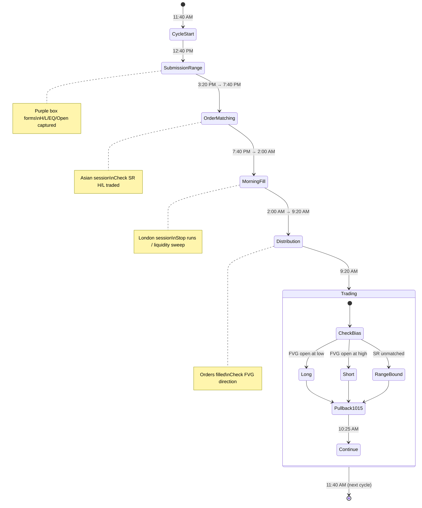

# TCM Akatsuki Bootcamp Indicator

**Source:** TCM_Akatsuki_Bootcamp_indicator_2026.mp4
**Duration:** 59 minutes 33 seconds
**Extracted:** 2026-01-13
**Type:** Skills Library (Indicator Framework)

---

## Overview

The TCM Akatsuki indicator is a comprehensive order flow visualization tool based on the **TCM Order Fulfillment Theory**. It models institutional order lifecycle through the trading day, identifying key time windows and price levels where orders are submitted, matched, filled, and distributed.

The core insight: **Liquidity only appears after orders are filled, not when submitted.** Understanding this lifecycle allows traders to anticipate where and when significant price movements will occur.

---

## Skills Used

| ID | Skill Name | Category |
|----|------------|----------|
| #101 | TCM Order Fulfillment Theory | Market Structure |
| #102 | Submission Range (SR) | Market Structure |
| #103 | Order Lifecycle Timeline (TCM) | Session Management |
| #104 | SR Deviation Levels | Risk Management |
| #105 | Sweep vs Run Detection (TCM) | Entry Patterns |
| #106 | 10:15 AM Pullback Pattern | Entry Patterns |
| #107 | Liquidity Pockets (TCM Six Types) | Market Structure |
| #108 | Matched vs Unmatched Orders (TCM) | Market Structure |

**Related Existing Skills:**
- #3 Liquidity Sweep Detection
- #55 Fair Value Gap
- #8 Time-based Session Windows

---

## Timeframe Configuration

| Timeframe | Purpose |
|-----------|---------|
| **Daily** | Identify if SR H/L were matched in Asian session |
| **H1/H4** | Session structure and FVG identification |
| **M5** | Entry execution and distribution tracking |
| **M1** | Precision entries during 9:20+ distribution |

---

## Order Lifecycle Timeline

```
         11:40 AM                    12:40 PM          3:20 PM
            │                           │                 │
            ▼                           ▼                 ▼
    ┌───────────────────────────────────────────────────────────┐
    │  CYCLE      │         SUBMISSION RANGE          │         │
    │  START      │  (Orders accumulating - purple)   │         │
    └───────────────────────────────────────────────────────────┘
                                                         │
                                                         ▼
                                    ┌─────────────────────────────┐
                                    │   7:40 PM - ORDER MATCHING  │
                                    │   (Asian session - sweeps)  │
                                    └─────────────────────────────┘
                                                         │
                                                         ▼
                                    ┌─────────────────────────────┐
                                    │   2:00 AM - MORNING SESSION │
                                    │   (London fills - stop runs)│
                                    └─────────────────────────────┘
                                                         │
                                                         ▼
    ┌───────────────────────────────────────────────────────────┐
    │  9:20 AM - ORDER FULFILLMENT/DISTRIBUTION (NY open)       │
    │  Target: SR H/L, deviation levels, liquidity pockets      │
    └───────────────────────────────────────────────────────────┘
                         │
                         ▼
              ┌───────────────────┐
              │ 10:15 AM PULLBACK │
              │ (sweep/continue)  │
              └───────────────────┘
```

---

## State Machine



---

## Entry Checklist

### Pre-Session (Before 9:20 AM)

- [ ] Mark Submission Range (12:40-3:20 PM prior day)
- [ ] Record SR High, Low, EQ, Open
- [ ] Note SR size in points
- [ ] Check if Asian session traded to SR H/L
- [ ] Identify FVGs at SR H/L (sweep vs run)
- [ ] Calculate expected deviations based on SR size:
  - [ ] SR < 80 pts → expect 2+ deviations
  - [ ] SR 80-150 pts → expect 1-1.5 deviations
  - [ ] SR > 150 pts → expect 0.5-0.25 deviations

### Entry Window (9:20 AM - 11:40 AM)

- [ ] Confirm distribution direction from London fills
- [ ] Check if price above/below 9:20 open
- [ ] Wait for 10:15-10:25 AM pullback setup
- [ ] If above 9:20 open: avoid shorts
- [ ] If below 9:20 open: favor shorts
- [ ] Target: SR H/L (if matched) or deviation level

### Avoid Trading

- [ ] 11:00 AM - 1:00 PM (slow, choppy)
- [ ] When SR H/L were not matched (range-bound day)
- [ ] Against FVG direction from Asian/London

---

## Indicator Components

### Visual Elements

| Element | Color | Description |
|---------|-------|-------------|
| Submission Range | Purple box | 12:40-3:20 PM H/L/EQ |
| Matching Window | Red box | Asian session range |
| Cycle Open | Vertical line | 11:40 AM marker |
| 9:20 Open | Horizontal line | Distribution reference |
| Deviation Levels | Dashed lines | 0.5, 1, 1.5, 2 SD |

### Inputs

| Input | Default | Description |
|-------|---------|-------------|
| Show SR Box | true | Display submission range |
| Show Deviations | true | Display SD levels |
| Show Cycle Lines | true | Vertical time markers |
| Deviation Multiplier | 1.0 | Adjust deviation distance |
| Timezone | America/New_York | All times in ET |

---

## Trade Plan Integration

### Long Setup

1. SR matched in Asian session (price traded to SR low with FVG)
2. FVG stays open (run, not sweep)
3. London fills below SR low
4. Distribution (9:20 AM) starts moving higher
5. Wait for 10:15 pullback
6. Enter long targeting SR high or 1+ deviation above

### Short Setup

1. SR matched in Asian session (price traded to SR high with FVG)
2. FVG stays open (run, not sweep)
3. London fills above SR high
4. Distribution (9:20 AM) starts moving lower
5. Wait for 10:15 pullback
6. Enter short targeting SR low or 1+ deviation below

### Range-Bound (No Trade)

1. SR H/L NOT traded to in Asian session
2. Orders remain unmatched = no liquidity at SR levels
3. Expect distribution to stay inside SR
4. Only trade liquidity pockets (open prices, imbalances)

---

## Risk Management

| Parameter | Value | Notes |
|-----------|-------|-------|
| Entry Window | 9:20 AM - 10:25 AM | Best entries after pullback |
| Avoid Window | 11:00 AM - 1:00 PM | Low probability setups |
| Stop Placement | Below/above 10:15 sweep | Or below matched SR level |
| Target 1 | SR EQ or opposite SR level | If SR matched |
| Target 2 | 1 standard deviation | Based on SR size |
| Target 3 | 2 standard deviation | Only if SR < 80 pts |

---

## Pine Script Integration Notes

### Key Variables

```
// Time windows (ET)
cycleStart = timestamp("America/New_York", year, month, dayofmonth, 11, 40)
srStart = timestamp("America/New_York", year, month, dayofmonth, 12, 40)
srEnd = timestamp("America/New_York", year, month, dayofmonth, 15, 20)
distributionStart = timestamp("America/New_York", year, month, dayofmonth, 09, 20)
pullbackTime = timestamp("America/New_York", year, month, dayofmonth, 10, 15)

// SR tracking
var float srHigh = na
var float srLow = na
var float srEQ = na
var float srOpen = na
var bool srMatched = false
```

### Deviation Calculation

```
srRange = srHigh - srLow
dev05 = srRange * 0.5
dev10 = srRange * 1.0
dev15 = srRange * 1.5
dev20 = srRange * 2.0

// Expected deviation based on range size
expectedDev = srRange < 80 ? 2.0 : srRange < 150 ? 1.5 : 0.5
```

---

## Source Attribution

- **Creator:** TCM (The Currency Market)
- **Video:** Akatsuki Bootcamp Indicator 2026
- **Concepts:** Order Fulfillment Theory, Submission Range, Deviation Levels
- **Indicator:** Custom TradingView Pine Script

---

## Changelog

- 2026-01-13: Initial extraction from bootcamp video
- Skills #101-108 created in builder.db
