# LumiTraders Liquidity Sweep - Complete Visual Documentation

## Overview

ICT-based liquidity sweep strategy with order block entry, optimized for ES (E-mini S&P 500). Features multi-timeframe analysis, CISD confirmation, and 11AM fade strategy.

**Source:** https://youtu.be/-D_JBnsMsAA

---

## 1. Multi-Timeframe Hierarchy

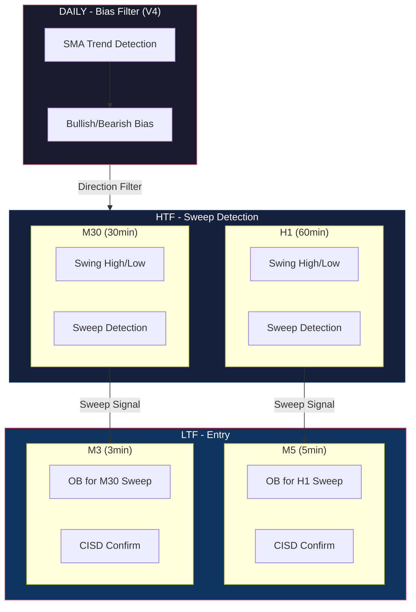

---

## 2. Complete State Machine

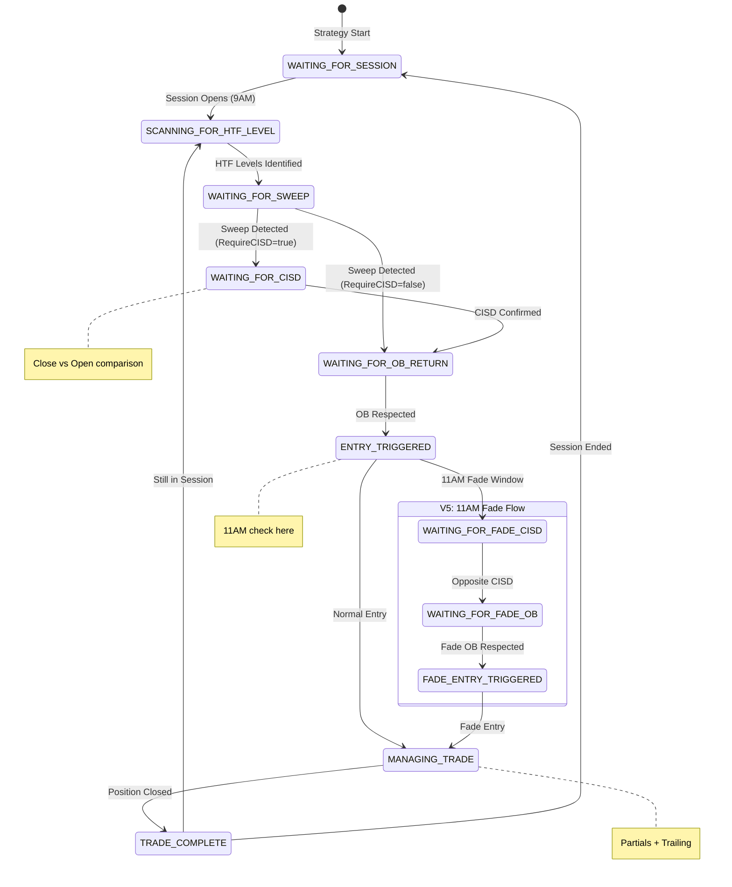

---

## 3. Timeframe Pairing Logic

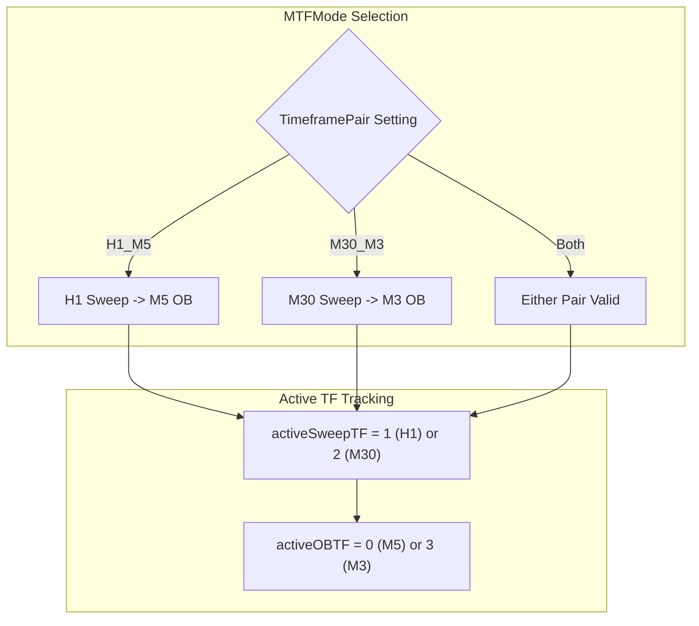

---

## 4. Sweep Detection Flow

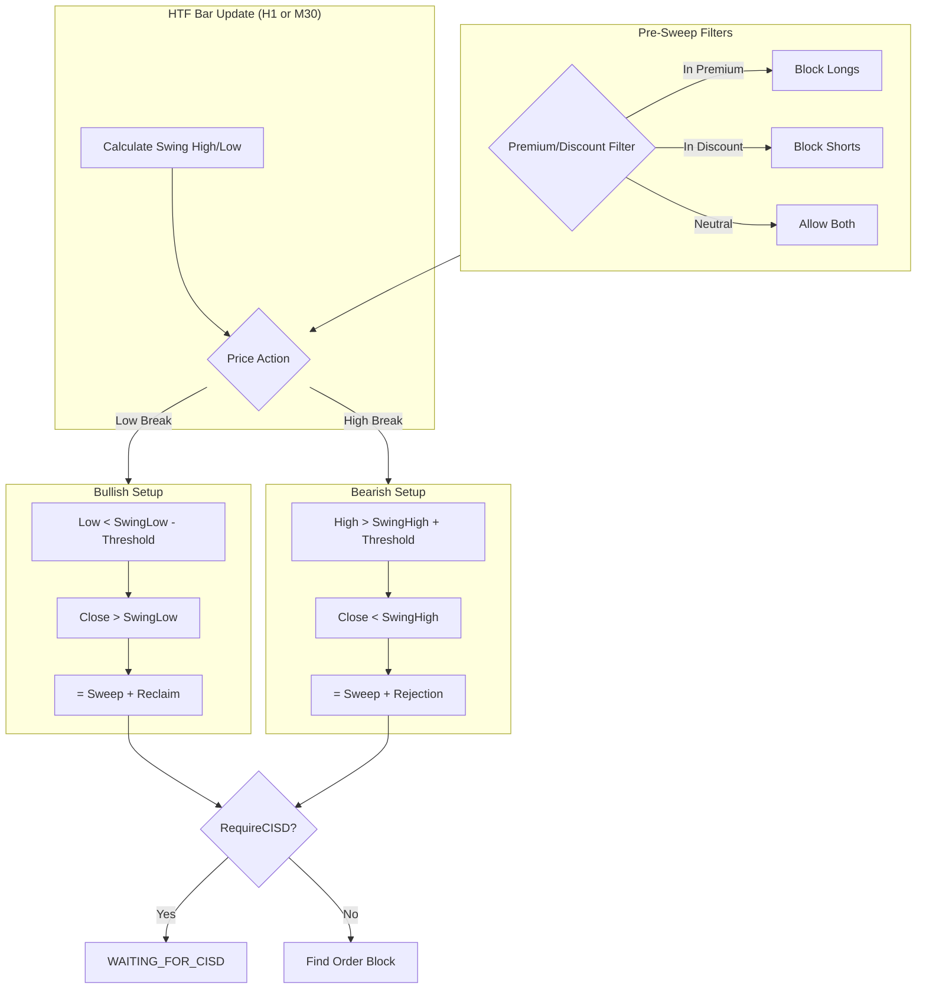

---

## 5. CISD Confirmation (Change in State of Delivery)

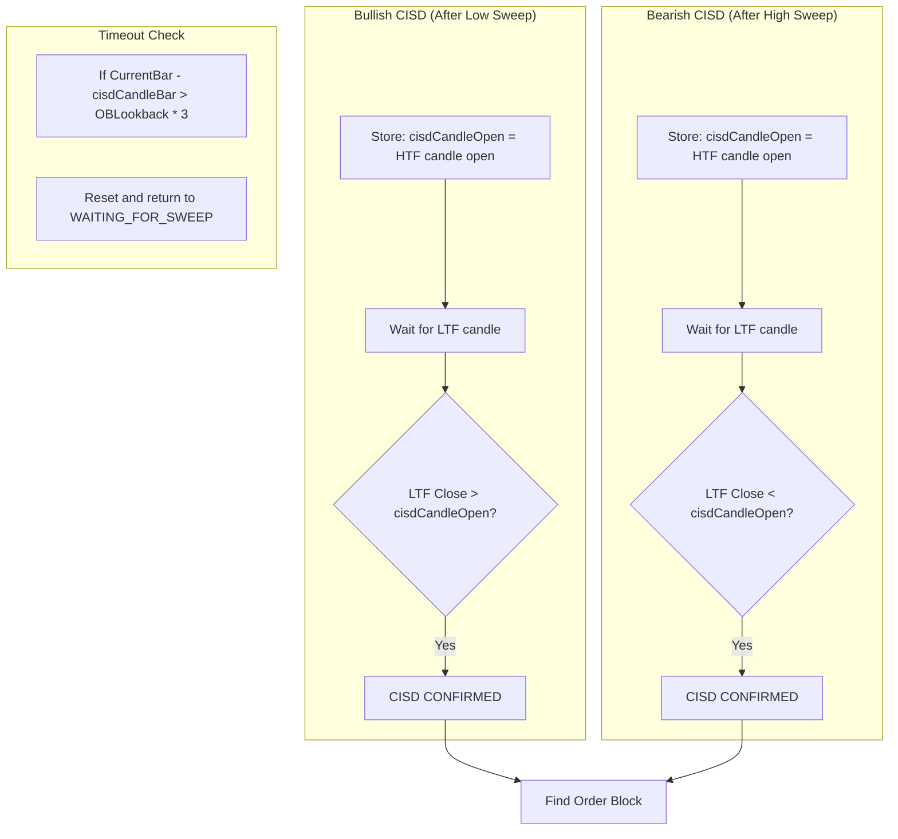

---

## 6. Order Block Detection & Entry

```mermaid
flowchart TD
    subgraph OB_FIND["FindOrderBlock(direction)"]
        F1{Sweep Direction}
        F1 -->|Bullish (1)| BULL_OB["Find last BEARISH candle\n(Close < Open)"]
        F1 -->|Bearish (-1)| BEAR_OB["Find last BULLISH candle\n(Close > Open)"]
    end

    subgraph OB_ZONE["Order Block Zone"]
        Z1["orderBlockHigh = High[i]"]
        Z2["orderBlockLow = Low[i]"]
        Z3["obPullbackLevel = OBLow + (Range * PullbackPercent)"]
    end

    subgraph OB_RETURN["Wait for OB Return"]
        R1{Price enters OB zone?}
        R2{Pullback >= 50% into OB?}
        R3{Close respects OB?}
        R4["OB RESPECTED - Entry Ready"]

        R1 -->|Yes| R2
        R2 -->|Yes| R3
        R3 -->|Yes| R4
    end

    BULL_OB --> Z1 --> Z2 --> Z3
    BEAR_OB --> Z1
    Z3 --> R1

    style R4 fill:#00aa55,color:#fff
```

---

## 7. Premium/Discount Zone Filter

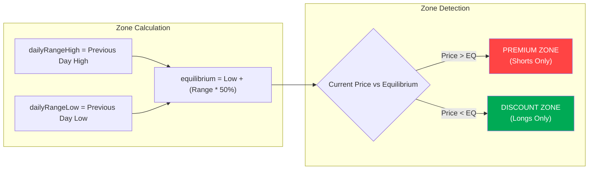

---

## 8. V5: 11AM Fade Strategy

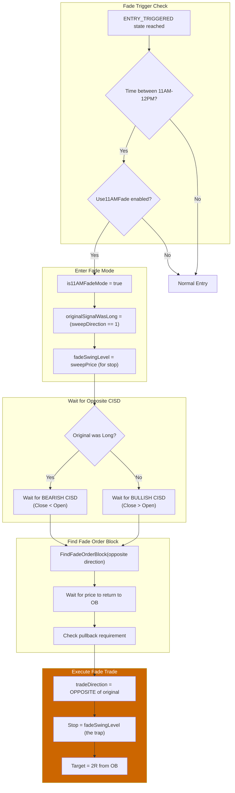

---

## 9. Complete Trade Flow

```mermaid
flowchart TD
    subgraph SESSION["Session Check"]
        A1([9AM Session Open])
        A2[Scan for HTF Swing Levels]
    end

    subgraph HTF_SETUP["HTF Setup (H1/M30)"]
        B1[Identify Swing High/Low]
        B2{Sweep Detected?}
        B3[Store sweep info]
    end

    subgraph CONFIRM["Confirmation (LTF)"]
        C1{CISD Required?}
        C2[Wait for CISD]
        C3[Find Order Block]
        C4{Price returns to OB?}
        C5{OB Respected?}
    end

    subgraph ENTRY_GATE["Entry Gate"]
        D1{11AM Window?}
        D2[Normal Entry]
        D3[Fade Mode]
    end

    subgraph EXECUTION["Trade Execution"]
        E1[Calculate Stop at Sweep Level]
        E2[Calculate 2R Target from OB]
        E3{Valid Setup?}
        E4[ENTER TRADE]
    end

    subgraph MANAGEMENT["Trade Management"]
        M1[Monitor Position]
        M2{1R Profit?}
        M3[Take 50% Partial]
        M4[Move to Breakeven]
        M5[Trail Stop to Swings]
        M6{Consolidation?}
        M7[Cut Trade Early]
    end

    A1 --> A2 --> B1
    B1 --> B2
    B2 -->|Yes| B3
    B3 --> C1
    C1 -->|Yes| C2
    C1 -->|No| C3
    C2 --> C3
    C3 --> C4
    C4 -->|Yes| C5
    C5 -->|Yes| D1
    D1 -->|Yes + Fade On| D3
    D1 -->|No| D2
    D2 --> E1
    D3 --> E1
    E1 --> E2 --> E3
    E3 -->|Stop <= 150 ticks| E4
    E4 --> M1
    M1 --> M2
    M2 -->|Yes| M3
    M3 --> M4
    M4 --> M5
    M5 --> M6
    M6 -->|Yes, 5+ bars| M7

    style E4 fill:#0066cc,color:#fff
    style M3 fill:#00aa55,color:#fff
```

---

## 10. Trade Management (V3)

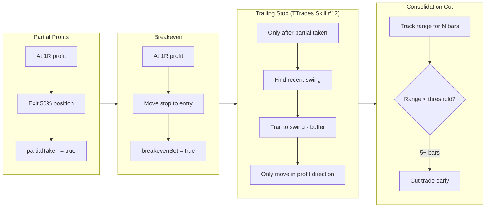

---

## 11. Risk Management Rules

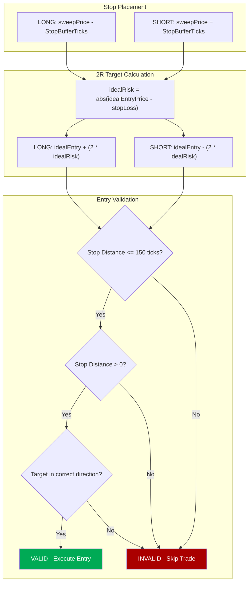

---

## 12. Session Timeline

```mermaid
gantt
    title LumiTraders ES - Daily Session Timeline
    dateFormat HH:mm
    axisFormat %H:%M

    section Session Windows
    Pre-Market : done, 06:00, 3h
    AM Session (Active) : crit, 09:00, 3h
    11AM Fade Window : active, 11:00, 1h
    PM Session (Avoided) : done, 13:00, 3h
    Session Close : done, 16:00, 2h

    section Typical Flow
    Scan HTF Levels : 09:00, 30m
    Wait for Sweep : 09:30, 1h
    CISD + OB Setup : 10:30, 30m
    Entry Window : 11:00, 1h
    Trade Management : 12:00, 1h
```

---

## 13. Data Series Index Reference

| Index | Timeframe | Purpose |
|-------|-----------|---------|
| 0 | M5 (5-min) | Primary chart, OB entry for H1 sweeps |
| 1 | H1 (60-min) | HTF sweep detection |
| 2 | M30 (30-min) | HTF sweep detection |
| 3 | M3 (3-min) | OB entry for M30 sweeps |
| 4 | Daily | HTF bias filter (V4) |

---

## 14. Key Concepts Summary

| Concept | Description | Key Variable |
|---------|-------------|--------------|
| HTF Sweep | Wick beyond swing level, close back inside | `sweepDetected`, `sweepDirection` |
| CISD | Close breaks opposing candle's open | `cisdConfirmed`, `cisdCandleOpen` |
| Order Block | Last opposing candle before sweep | `orderBlockHigh/Low` |
| OB Pullback | Price must enter 50% into OB | `OBPullbackPercent` |
| Premium/Discount | Previous day range divided at 50% | `inPremiumZone`, `inDiscountZone` |
| 11AM Fade | Trade opposite direction during 11-12 | `is11AMFadeMode`, `originalSignalWasLong` |
| Partial Profit | Exit 50% at 1R | `partialTaken`, `PartialPercent` |
| Trailing Stop | Follow protected swings | `trailingSwingLevel` |

---

## 15. Backtest Results (Reference)

| Metric | Value |
|--------|-------|
| Net P&L | $10,150 |
| Win Rate | 80.56% |
| Profit Factor | 8.20 |
| Day Win % | 84.21% |
| Avg Win/Loss | 1.98R |
| Zella Score | 89.61/100 |

---

*Generated from LumiTradersLiquiditySweepESStrategy.cs analysis*
