# TTrades Fractal Model - Complete Visual Documentation

## Overview

This document provides comprehensive Mermaid diagrams to visualize the TTrades Fractal Model (TTFM) for multi-timeframe analysis. Based on V11 implementation.

---

## 1. Multi-Timeframe Hierarchy

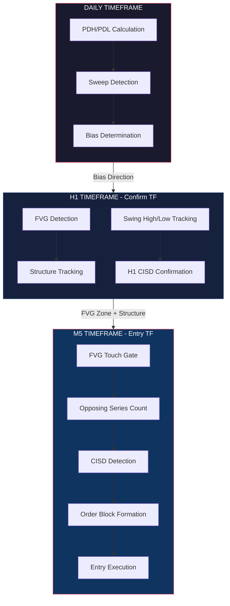

---

## 2. Complete State Machine

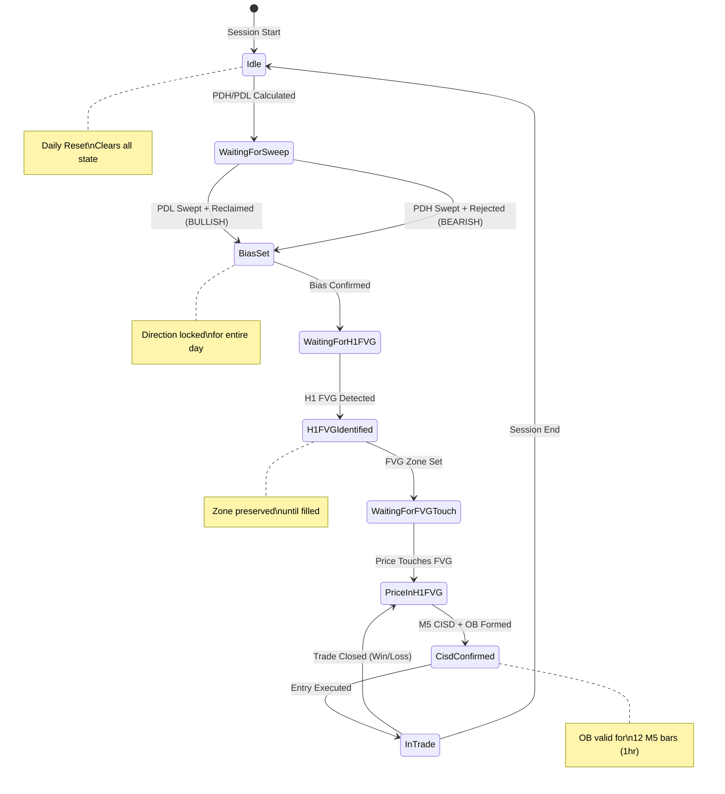

---

## 3. Bias Determination Flow (Daily)

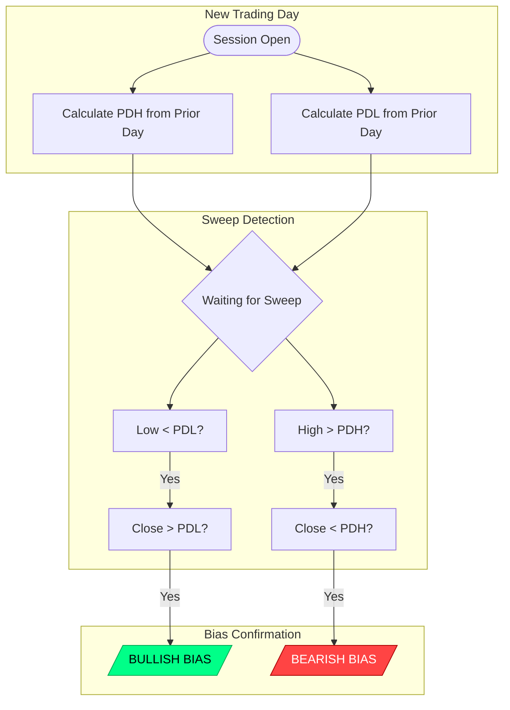

---

## 4. H1 FVG Detection

```mermaid
flowchart LR
    subgraph BULLISH_FVG["Bullish FVG - Gap UP"]
        direction TB
        B1["Candle [2]"]
        B2["Candle [1]"]
        B3["Candle [0]"]

        B1 --> B2 --> B3

        GAP_UP["GAP: Candle[0].Low > Candle[2].High"]
        ZONE_B["FVG Zone:\nTop = Candle[0].Low\nBottom = Candle[2].High"]

        GAP_UP --> ZONE_B
    end

    subgraph BEARISH_FVG["Bearish FVG - Gap DOWN"]
        direction TB
        R1["Candle [2]"]
        R2["Candle [1]"]
        R3["Candle [0]"]

        R1 --> R2 --> R3

        GAP_DN["GAP: Candle[0].High < Candle[2].Low"]
        ZONE_R["FVG Zone:\nTop = Candle[2].Low\nBottom = Candle[0].High"]

        GAP_DN --> ZONE_R
    end

    style BULLISH_FVG fill:#1a472a,stroke:#00ff88
    style BEARISH_FVG fill:#4a1a1a,stroke:#ff4444
```

---

## 5. FVG Touch Gate (Critical V11 Feature)

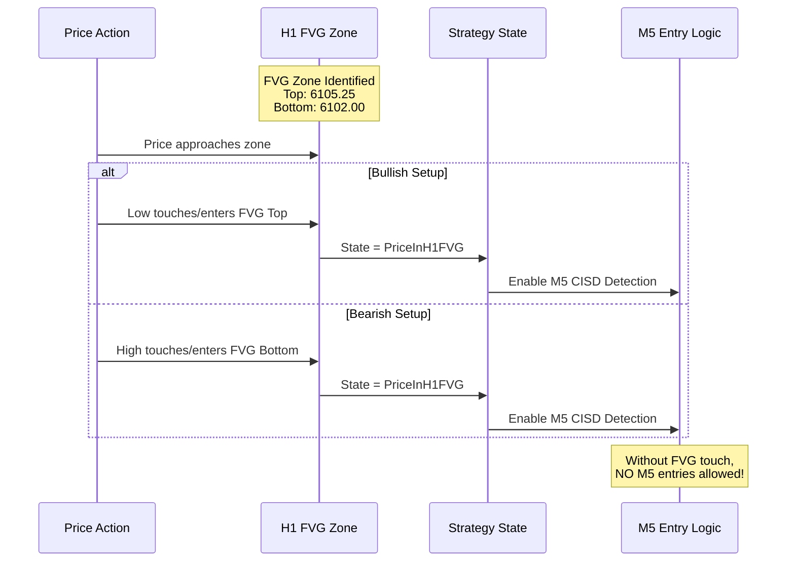

---

## 6. CISD Pattern (Change in State of Delivery)

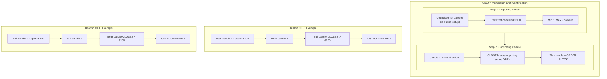

---

## 7. Order Block Formation & Entry

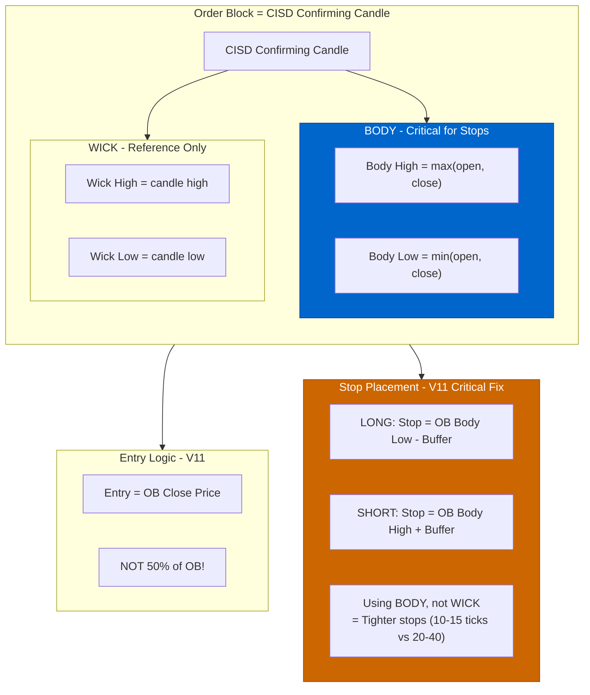

---

## 8. Complete Trade Flow (Happy Path)

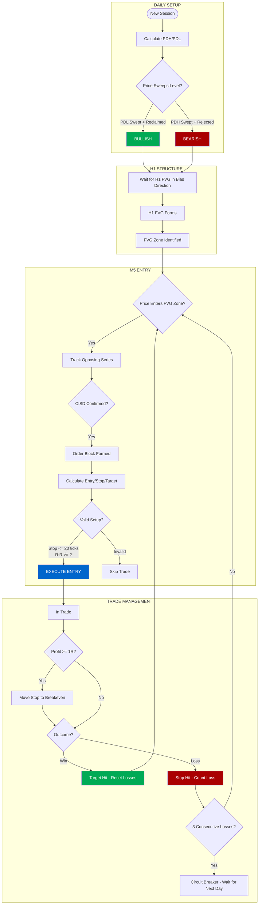

---

## 9. Risk Management Rules

```mermaid
flowchart LR
    subgraph FILTERS["Pre-Entry Filters"]
        F1["Max Stop: 20 ticks"]
        F2["Min Stop: 4 ticks"]
        F3["Min R:R: 2.0"]
        F4["Session: 9AM-4PM ET"]
        F5["Circuit Breaker: 3 losses"]
    end

    subgraph STOP_CALC["Stop Calculation - V11"]
        S1["LONG:\nstop = OB_BODY_LOW - 3 ticks"]
        S2["SHORT:\nstop = OB_BODY_HIGH + 3 ticks"]
    end

    subgraph TARGET_CALC["Target Calculation"]
        T1["Default: Entry + (Risk x R:R)"]
        T2["Alternative: PDH/PDL if closer"]
    end

    subgraph BREAKEVEN["Breakeven Logic"]
        BE1["At 1R profit"]
        BE2["Move stop to Entry + 1 tick"]
    end

    FILTERS --> STOP_CALC
    STOP_CALC --> TARGET_CALC
    TARGET_CALC --> BREAKEVEN
```

---

## 10. Data Flow Architecture

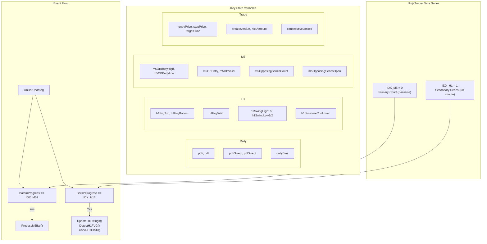

---

## 11. Session Timeline

```mermaid
gantt
    title TTrades Fractal Model - Daily Session Timeline
    dateFormat HH:mm
    axisFormat %H:%M

    section Session
    Pre-Market (No Trading) : done, 06:00, 3h
    NY Session Open : crit, 09:00, 7h
    NY Session Close : done, 16:00, 2h

    section Daily Setup
    Calculate PDH/PDL : milestone, 09:00, 0h
    Wait for Sweep : 09:00, 2h

    section Typical Flow
    Bias Set (Sweep) : 09:30, 30m
    H1 FVG Forms : 10:00, 1h
    FVG Touch : 11:00, 1h
    M5 Entry Setup : 12:00, 2h
    Trade Management : 14:00, 2h
```

---

## 12. Key Concepts Summary

| Concept | Timeframe | Purpose | Key Variable |
|---------|-----------|---------|--------------|
| PDH/PDL | Daily | Liquidity levels for sweep | `pdh`, `pdl` |
| Sweep | Daily | Bias determination | `pdhSwept`, `pdlSwept` |
| Bias | Daily | Trade direction filter | `dailyBias` |
| FVG | H1 | Structure zone (entry area) | `h1FvgTop`, `h1FvgBottom` |
| FVG Touch | H1->M5 | Gate to enable M5 entries | `currentState` |
| CISD | H1/M5 | Momentum shift confirmation | `m5OpposingSeriesOpen` |
| Order Block | M5 | Entry candle (CISD confirming) | `m5OBBodyHigh/Low` |
| Stop | M5 | Risk anchor (OB BODY, not wick) | `stopPrice` |

---

## 13. Version Evolution

| Version | Key Changes |
|---------|-------------|
| V6 | Base fractal model with CISD |
| V7 | Added swing tracking on H1 |
| V8 | H1 structure validation (lower highs/higher lows) |
| V9a | Faster swing detection, preserve swing history |
| V9b | Alternative approach exploration |
| V10 | FVG zone refinements |
| V11 | **FVG Touch Gate + OB Body stops (10-15 ticks vs 20-40)** |

---

*Generated from TTradesFractalModelV11.cs analysis*
